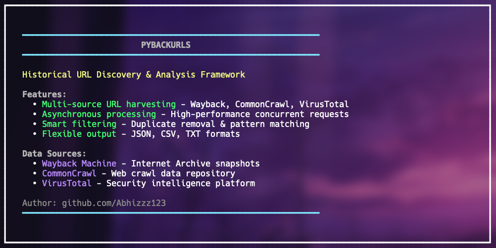

# PyBackURLs

**Python-based URL Harvester and Recon Tool**

PyBackURLs is a powerful Python tool that extracts archived URLs from the Wayback Machine, Common Crawl, and VirusTotal. A modern alternative to the Go-based waybackurls utility, it features enhanced filtering, smart URL cleaning, and recon highlights for bug bounty and OSINT gathering.

---

# Features

<h1 align="left">
  </a>
  <br>
</h1>

- Asynchronously fetches URLs from multiple archival sources for speed and coverage
- Advanced filtering options:
  - Include/exclude by file extension
  - Include/exclude URLs matching specific patterns
  - Minimum URL length filtering
  - Date range filtering by archived snapshot date
- Recon highlight detection for:
  - Admin panels, backup/config files, API endpoints, sensitive directories, etc.
- Supports multiple output formats: Plain text, JSON, CSV, HTML
- Real-time progress display and detailed statistics reporting
- Modular and extensible architecture for easy customization

---

# Installation

## Prerequisites

- Python **3.8** or higher

```yaml
git clone https://github.com/YourUsername/PyBackURLs.git
cd PyBackURLs
pip install -r requirements.txt
```


## Usage

Run the tool from the command line:
```yaml
python pybackurls.py [options] domain1.com domain2.com ...
```

### Common Options

```yaml
Helpmenu:

| Option                   | Description                                                   |
|--------------------------|---------------------------------------------------------------|
| `--include-subs`         | Include subdomains of target domains                           |
| `--format`               | Output format- `txt` (default), `json`, `csv`, or `html`       |
| `--output`, `-o`         | Output filename (default is auto-generated in `out/` folder)  |
| `--threads`              | Number of concurrent threads (default 50)                      |
| `--extensions`           | Only include URLs with these comma-separated file extensions   |
| `--exclude-extensions`   | Exclude URLs with these comma-separated file extensions        |
| `--minlen`               | Minimum URL length to include (default 10)                     |
| `--include`              | Only include URLs containing these substrings (comma-separated)|
| `--exclude`              | Exclude URLs containing these substrings (comma-separated)    |
| `--start-date`           | Start date filter (format YYYY-MM-DD)                          |
| `--end-date`             | End date filter (format YYYY-MM-DD)                            |
| `--analyze`              | Perform detailed URL analysis                                  |
| `--show-stats`           | Show harvesting statistics                                     |
| `--interactive`          | Run in interactive mode for manual domain input                |
| `-h`, `--help`           | Show the help message with all available options               |
```
---

# Usage Examples

- **Fetch URLs for a domain**:
```console
python pybackurls.py example.com
```

- **Include subdomains and output JSON**:
```console
python pybackurls.py example.com --include-subs --format json -o example_urls.json
```

- **Filter to only JavaScript and PHP files, minimum URL length 20, and show stats**:
```console
python pybackurls.py example.com --extensions js,php --minlen 20 --show-stats
```

- **Exclude URLs containing "logout" or "signup":**
```console
python pybackurls.py example.com --exclude logout,signup
```

- **Fetch URLs within a date range:**
```console
python pybackurls.py example.com --start-date 2020-01-01 --end-date 2023-12-31
```

- **Run analysis and show recon highlights:**
```console
python pybackurls.py example.com --analyze --show-stats
```

---

## Output

By default, results are saved to the `result/` directory with timestamped filenames.

Formats supported:

- **Plain text**: one URL per line
- **JSON**: detailed records with fields and analysis statistics
- **CSV**: columns for URL, source, timestamp, status
- **HTML**: human-readable report with highlights

---

## Contributing

Contributions, issues, and feature requests are welcome!  
Feel free to open an issue or submit a pull request.

---

## License

This project is licensed under the MIT License. See the [LICENSE](LICENSE) file for details.

---

## Contact

Developed by Abhishek - josephinevincent4@gmail.com 

---

Happy hunting and recon!  
